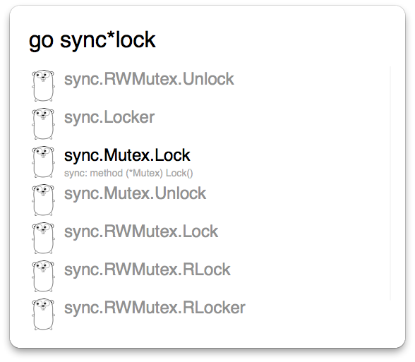

# Alfred Go Documents

Search Go documents right inside Alfred. Hit return on result to open the document in golang.org.
You need to have Alfred 2.0 and Powerpack to use this workflow.

## Download

[Go-Documents.alfredworkflow](https://github.com/shaoshing/alfred-go-documents/raw/master/Go-Documents.alfredworkflow)
